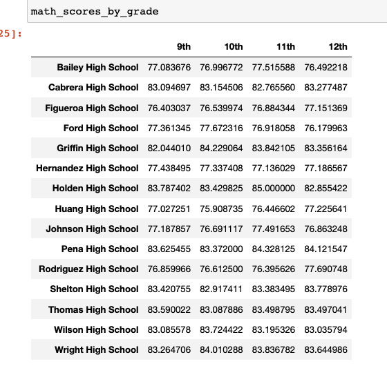
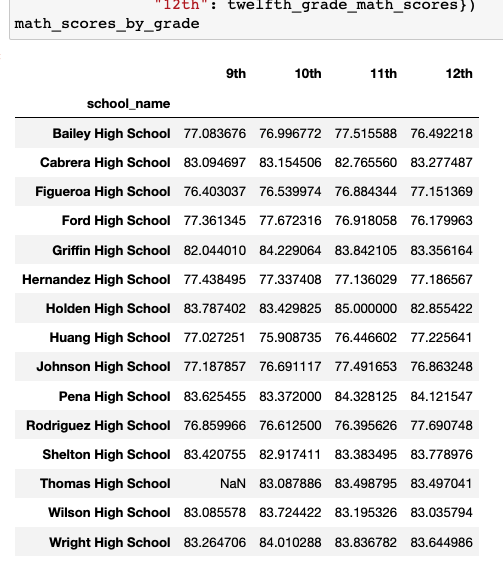
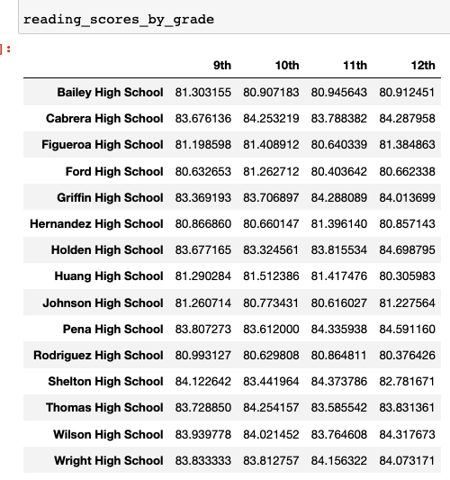
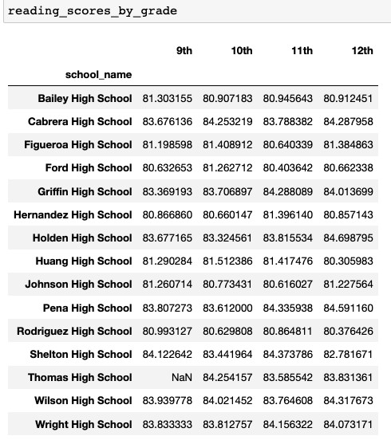
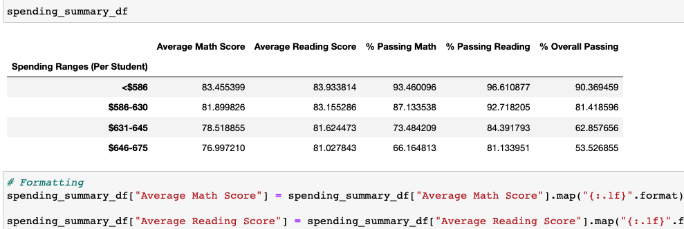
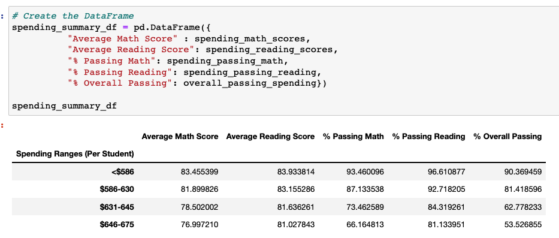
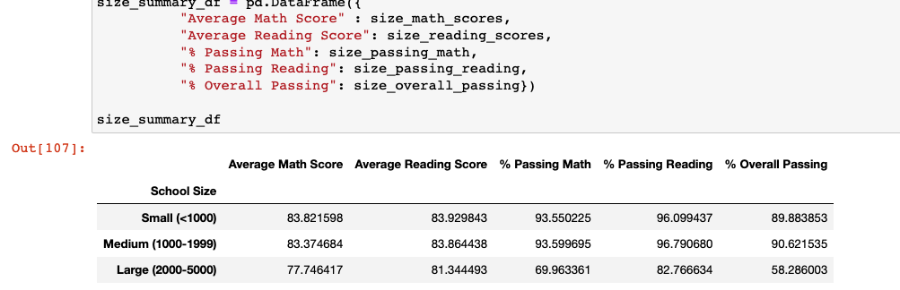
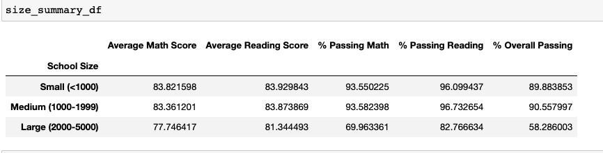
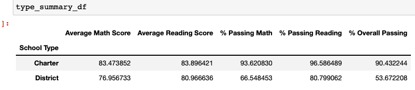
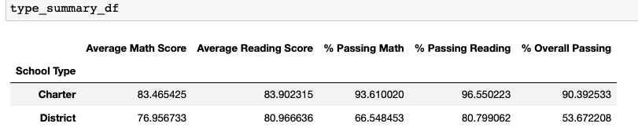

# School District Analysis
Python3.9 and Jupyter Notebooks

## Overview of the project
This project was to analyze the school districts overall summary. Highlighting the relationships between school scores, budget and student size.
It was discovered that there may be a discrepancy with the 9th grade class at Thomas High School. So, we re-analyzed the school data factoring out
the 9th grade class scores from Thomas High school. We did this by replacing all of 9th grade Reading and Math scores to NaN (not-a-number) at Thomas High School
while keeping the rest of the data in tact. We then re-ran the school district analysis.

### Results
Overall, the District Summary was minimally affected by the discrepancy of the 9th grade class at Thomas High. We saw a 
- 0.1% drop in Overall Passing percentage.
- 0.3% drop in Passing Reading percentage.
- 0.2% drop in Passing Math percentage.
- 0.1% drop in Average Math Scores.
- and No Change in Average Reading Scores.

Thomas High Schools scores were drastically affected. After omitting the 9th grade class scores we saw:
- 25.55% increase to 90.63% in Overall Passing percentage.
- 27.35% increase to 97.02% in Passing Reading percentage.
- 26.27% increase to 93.18% in Passing Math percentage.

Interestingly, there were no changes in their Average Math Scores or Average Reading Scores.

Relative to other schools, replacing the 9th graders' math and reading scores made Thomas High ranked the Top #2 school in the district.
Where previously, it was ranked 8th in the district.

Regarding Math and Reading scores by grade, there is no changes other than Thomas High's 9th grade class having No scores

The re-evaluated analysis had very little impact on the scores by School Spending. We saw:
- No changes in the *<$586 , $586-630 and $646-675* Spending ranges per student
- Very slight changes in the *$631-645* Spending range per student. This is the range Thomas High falls in.
  - 0.079% drop to 62.778% Overall 
  - 0.072% drop to 84.319% Passing Reading
  - 0.322% drop to 73.462% Passing Math
  - 0.016 point drop to 78.502 in Average Math score
  - but a slight .012 point increase to 81.636 in Average Reading

Medium size school's , which Thomas High is a part of, scores were slightly affected. We saw:
- 0.07% drop in Overall percentage
- 0.06% drop in Passing Reading
- 0.01% drop in Passing Math
- 0.01 point drop in Average Math scores
- but a 0.01 point increase in Average Reading scores
	

Lastly, there is a slight impact on Charter school scores, which Thomas High is a part of. We saw:
- 0.04% drop in Overall percentage
- 0.03% drop in Passing Reading
- 0.01% drop in Passing Math
- 0.01 point drop in Average Math scores
- but a 0.01 point increase in Average Reading scores

### Summary
In summary, we saw a slight impact in the Overall District Summary 
- with less than 1% drops in Passing percentages and Average scores.
- a very slight impact on Scores based on Thomas High's Spending, Size and Type catagories.
- But we saw a drastic impact on Thomas High's Scores in the School Summary
- And we saw a drastic impact on school rank, with Thomas High jumping to #2 from #8.
