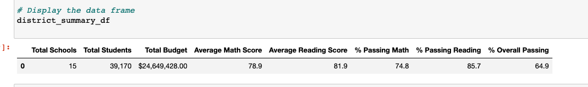

# School District Analysis
Python3.9 and Jupyter Notebooks

## Overview of the project
This project was to analyze the school districts overall summary. Highlighting the relationships between school scores, budget and student size.
It was discovered that there may be a discrepancy with the 9th grade class at Thomas High School. So, we re-analyzed the school data factoring out
the 9th grade class scores from Thomas High school. We did this by replacing all of 9th grade Reading and Math scores to NaN (not-a-number) at Thomas High School
while keeping the rest of the data in tact. We then re-ran the school district analysis.

### Results
Overall, the District Summary was minimally affected by the discrepancy of the 9th grade class at Thomas High. We saw a 
	- 0.1% drop in Overall Passing percentage.
	- 0.3% drop in Passing Reading percentage.
	- 0.2% drop in Passing Math percentage.
	- 0.1% drop in Average Math Scores.
	- and No Change in Average Reading Scores.

Thomas High Schools scores were drastically affected. After omitting the 9th grade class scores we saw:
	- 25.55% increase to 90.63% in Overall Passing percentage.
	- 27.35% increase to 97.02% in Passing Reading percentage.
	- 26.27% increase to 93.18% in Passing Math percentage.

Interestingly, there were no changes in their Average Math Scores or Average Reading Scores.

Relative to other schools, replacing the 9th graders' math and reading scores made Thomas High ranked the Top #2 school in the district.
Where previously, it was ranked 8th in the district.

UPDATING README NOW SINCE ALL OF MY DATAFRAMES ARE NOW THE SAME AND I CAN'T COMPARE WHAT ORIFGINAL TO UPDATED